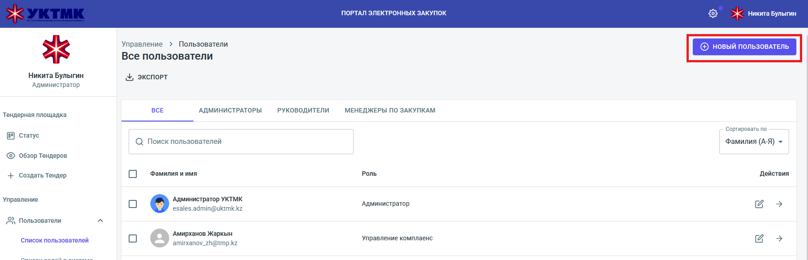

Администратор заходит на портал менеджера (https://manager.purchase.uktmp.kz/app/reports/dashboard) и регистрирует нового пользователя. Выбирает меню "список пльзователей"

Далее нажимает "добавить нового пользователя

Заполняет данные пользователя. Важными являются Email - на него приходит код верификации почты и дальнейшие процессы, такие как сброс пароля, делаются через почту. Поле логин директум является обязатлеьным - в дальнейшем уведомления и запускаемые процессы приходят от этого логина

Далее администратор передает временный пароль пользователю

---------------
Пользователь.

Заходит на портал https://manager.purchase.uktmp.kz, вводит логин - пароль выданные админисратором.

Далее на почту приходит верификационный код, его нужно ввести во всплываемое поле. После чего вход на портал разрешен

----
Сброс пароля.
Заходит на портал https://manager.purchase.uktmp.kz.

Нажимает кнопку "забыли пароль".
Вводит элеткронную почту куда приходит код для сброса пароля.
Открывается окно с вводом нового пароля и кода. После чего сброс пароля успешно произведен