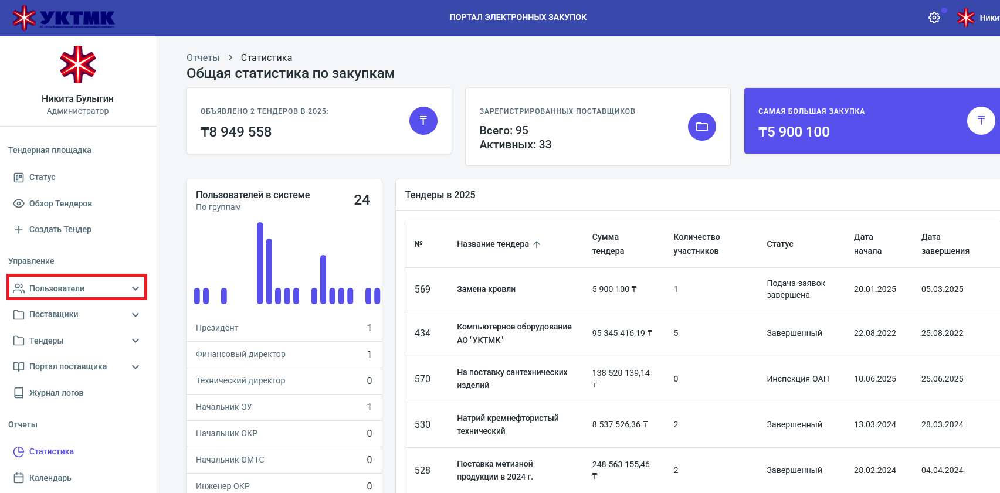
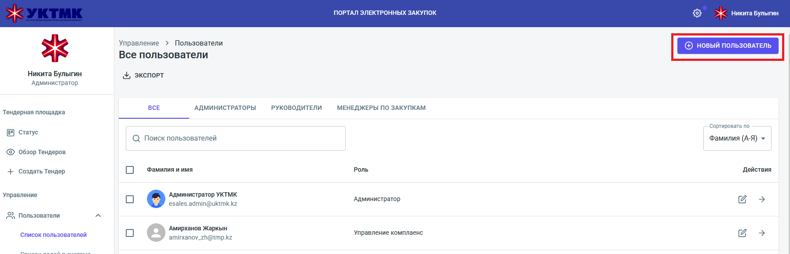

# 👨‍💼 ИНСТРУКЦИЯ ДЛЯ АДМИНИСТРАТОРА
## Регистрация новых пользователей в портале закупок УКТМК

---

## 🎯 Что нужно делать?
Как администратор, вы регистрируете новых пользователей в системе закупок и передаете им данные для входа.

---

## 📋 ПОШАГОВАЯ ИНСТРУКЦИЯ

### Шаг 1: Войдите в административную панель
1. **Откройте браузер** и перейдите по адресу: `https://manager.purchase.uktmp.kz/app/reports/dashboard`
2. **Введите свои данные** администратора для входа
3. **Нажмите "ВОЙТИ"**

### Шаг 2: Найдите раздел управления пользователями
1. **В левом меню** найдите раздел "Управление"
2. **Нажмите на "Пользователи"** (иконка с двумя людьми)
3. **Выберите "Список пользователей"**

### Шаг 3: Добавьте нового пользователя
1. **Нажмите кнопку "+ НОВЫЙ ПОЛЬЗОВАТЕЛЬ"** (фиолетовая кнопка в правом верхнем углу)
2. **Откроется форма** для заполнения данных пользователя

### Шаг 4: Заполните данные пользователя
**ОБЯЗАТЕЛЬНЫЕ поля:**
- **Email пользователя** - на этот адрес придет код верификации
- **Логин Директум** - обязательное поле для уведомлений и процессов
- **Имя и фамилия** пользователя
- **Роль** в системе (выберите из списка)
- **Временный пароль** (придумайте надежный)

**ВАЖНО:** 
- Email должен быть рабочим и доступным пользователю
- Логин Директум используется для всех системных уведомлений
- Пароль должен быть надежным (минимум 8 символов, цифры и буквы)

### Шаг 5: Сохраните данные
1. **Проверьте** все заполненные поля
2. **Нажмите "Сохранить"** или "Создать пользователя"
3. **Система создаст** учетную запись пользователя

### Шаг 6: Передайте данные пользователю
**Обязательно сообщите пользователю:**
- **Логин** (email или логин Директум)
- **Временный пароль**
- **Ссылку** на портал: `https://manager.purchase.uktmp.kz`
- **Инструкцию** по первому входу

---

## ⚠️ ВАЖНЫЕ МОМЕНТЫ

### Безопасность:
- **Не передавайте** данные по незащищенным каналам
- **Используйте** надежные временные пароли
- **Требуйте** смены пароля при первом входе

### Контроль:
- **Проверяйте** активность пользователей
- **Отслеживайте** неудачные попытки входа
- **Блокируйте** неактивные учетные записи

### Поддержка:
- **Помогайте** пользователям при проблемах со входом
- **Объясняйте** процесс верификации по email
- **Контролируйте** правильность заполнения профилей

---

## 🔧 РЕШЕНИЕ ПРОБЛЕМ

### Если пользователь не может войти:
1. **Проверьте** правильность email в системе
2. **Убедитесь**, что пароль не истек
3. **Проверьте**, не заблокирован ли аккаунт
4. **Помогите** с процедурой сброса пароля

### Если не приходят письма:
1. **Проверьте** настройки почтового сервера
2. **Посмотрите** в папку "Спам" пользователя
3. **Проверьте** правильность email адреса

---

## 📞 КОНТАКТЫ И ПОДДЕРЖКА

При технических проблемах:
- **Обратитесь** к техническому администратору
- **Проверьте** логи системы
- **Убедитесь** в работоспособности почтовых сервисов

---
