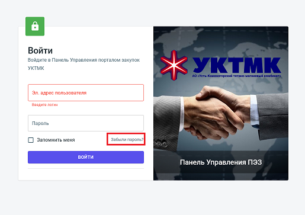

# 👤 ИНСТРУКЦИЯ ДЛЯ ПОЛЬЗОВАТЕЛЯ
## Как войти в портал закупок УКТМК

---

## 🎯 Что это такое?
Это ваш личный кабинет для работы с закупками компании УКТМК. Здесь вы можете участвовать в тендерах, просматривать заказы и управлять своими заявками.

---

## 📧 ПЕРВЫЙ ВХОД (когда администратор дал вам данные)

### Шаг 1: Откройте сайт
1. **Откройте браузер** (Chrome, Firefox, Edge - любой)
2. **В адресной строке** (вверху страницы) напишите: `https://manager.purchase.uktmp.kz`
3. **Нажмите Enter** на клавиатуре

### Шаг 2: Введите данные для входа
1. **В поле "Эл. адрес пользователя"** введите логин, который дал администратор
2. **В поле "Пароль"** введите пароль, который дал администратор
3. **Поставьте галочку** в квадратике "Запомнить меня" (чтобы не вводить данные каждый раз)
4. **Нажмите кнопку "ВОЙТИ"** (фиолетовая кнопка)

### Шаг 3: Подтвердите вход по почте
1. **Откройте свою электронную почту** (Gmail, Mail.ru, Яндекс и т.д.)
2. **Найдите письмо** от системы (может быть в папке "Спам")
3. **Скопируйте код** из письма (обычно это 4-6 цифр)
4. **Вернитесь на сайт** и вставьте код в появившееся окошко
5. **Нажмите "Подтвердить"**

✅ **Готово!** Теперь вы можете работать в системе.

---

## 🔑 ЕСЛИ ЗАБЫЛИ ПАРОЛЬ

### Шаг 1: Откройте страницу входа
1. **Откройте сайт**: `https://manager.purchase.uktmp.kz`
2. **Нажмите на ссылку "Забыли пароль?"** (справа от поля пароля)

### Шаг 2: Введите свой email
1. **В появившемся окне** введите свой электронный адрес
2. **Нажмите "Отправить"**

### Шаг 3: Проверьте почту и создайте новый пароль
1. **Откройте почту** и найдите письмо с кодом
2. **Скопируйте код** из письма
3. **Вернитесь на сайт** и введите:
   - Код из письма
   - Новый пароль (придумайте надежный)
   - Подтвердите новый пароль
4. **Нажмите "Сохранить"**

✅ **Готово!** Теперь можете войти с новым паролем.

---

## 💡 ПОЛЕЗНЫЕ СОВЕТЫ

### Если что-то не работает:
1. **Проверьте интернет** - есть ли соединение
2. **Обновите страницу** - нажмите F5 или кнопку обновления
3. **Проверьте почту** - письма могут попасть в "Спам"
4. **Обратитесь к администратору** - он поможет

### Безопасность:
- **Не сообщайте** свой пароль другим людям
- **Выходите** из системы, когда закончили работу
- **Используйте** надежные пароли (с цифрами и буквами)

---
